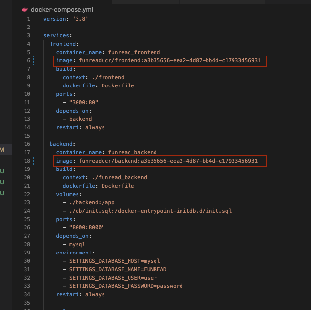

# FUNREAD

## Correr app usando Docker

Actualmente la plataforma cuenta con la habilidad de correrse utilizando docker containers. Cada uno de los servicios están definidos en el `docker-compose.yml` en el root directory del projecto. Los servicios definidos por el momento son `frontend`, `backend` y `mysql` respectivamente. Las imágenes que se utilizan para correr los dos primeros son `funreaducr/backend:main` y `funreaducr/frontend:main`.

Se agregaron steps en github actions con el fin de que se generen nuevos tags (ver archivo `.github/workflows/docker-publish.yml` para entender el proceso). Cada vez que se hace push al PR abierto o bien, se hace merge del PR a main se corre este proceso y se crean nuevos tags en nuestro docker hub (https://hub.docker.com/). Los credenciales para acceder a este hub son los siguientes:

* **username**: funreaducr
* **password**: Funread1234

Una vez se ingresa se pueden ver los tags creados basados en los pushes o merges. Los pushes generan GUIDs como tags. Los merges a main generan el tag `main` el cual se va a ir sobreescribiendo.

Si se desea probar un tag en especifico, se puede copiar el mismo y pegarlo en el `docker-compose.yml`, como se muestra en la siguiente imagen. Una vez copiado se puede correr la aplicación con docker (Ver sección `Ejecución`)

### Requerimientos

* Instalar Docker Desktop (la versión puede ser la más reciente, no afecta por el momento)
* Correr `docker -v` para verificar que se instaló correctamente

### Ejecución

* **docker compose build**: Permite hacer build de la imagenes con los cambios locales y los guarda localmente con el tag especificado en el `docker-compose.yml` para cada uno de los services.
* **docker compose up**: Levanta la aplicación en docker haciendo pull de los tags especificados en `docker-compose.yml`.